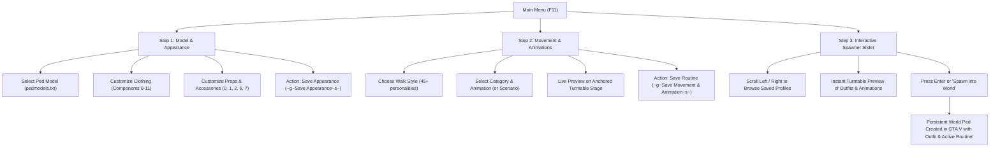

# 🕺 AdvancedPedStudio for Grand Theft Auto V

[-blue.svg)](#)
[](https://github.com/scripthookvdotnet/scripthookvdotnet)
[](https://github.com/Lemon-UI/LemonUI)
[](#)
[](#)
[](LICENSE)

**AdvancedPedStudio** is a premier 3D ped customization studio, wardrobe manager, animation testing suite, and world spawner for **Grand Theft Auto V**. Built with C#, **Script Hook V .NET v3**, and **LemonUI**, it provides an intuitive 3-step workflow to design, style, animate, persist, and spawn persistent custom ped characters directly into the game world in real time.

---

## 📖 Table of Contents

1. [🌟 Key Highlights](#-key-highlights)
2. [🔄 3-Step Studio Pipeline Overview](#-3-step-studio-pipeline-overview)
3. [📋 Prerequisites & Installation](#-prerequisites--installation)
4. [🎮 Studio Controls](#-studio-controls)
5. [🚶 Step-by-Step Studio Walkthrough](#-step-by-step-studio-walkthrough)
   - [Step 1: Select Model, Customize Clothing & Save Appearance](#step-1-select-model-customize-clothing--save-appearance)
   - [Step 2: Set Movement Style, Animations & Save Routine](#step-2-set-movement-style-animations--save-routine)
   - [Step 3: Interactive Spawner Slider & World Deployment](#step-3-interactive-spawner-slider--world-deployment)
   - [Bonus: Rolling the Randomizer](#bonus-rolling-the-randomizer)
   - [Bonus: Managing & Deleting Profiles](#bonus-managing--deleting-profiles)
6. [🎬 Curated Animation & Scenario Library](#-curated-animation--scenario-library)
7. [🛡️ Ground Stability & Anti-Fall Engine](#️-ground-stability--anti-fall-engine)
8. [📁 File Schemas & Configuration](#-file-schemas--configuration)
   - [pedmodels.txt](#1-pedmodelstxt)
   - [customizedpeds.ini](#2-customizedpedsini)
   - [AdvancedPedStudio.log](#3-advancedpedstudiolog)
9. [🛠️ Building from Source](#️-building-from-source)
10. [❓ Troubleshooting & FAQ](#-troubleshooting--faq)
11. [📜 Credits & License](#-credits--license)

---

## 🌟 Key Highlights

- **Streamlined 3-Step Pipeline:** Model & Outfits $\rightarrow$ Movement & Animations $\rightarrow$ Slider Selection & In-Game Spawner.
- **Turntable 3D Preview Stage:** Spawns an invincible preview ped ~10 feet in front of your character with smooth continuous 360° rotation for 3D inspection from all angles.
- **Zero-Fall Ground Stability:** Advanced 3D downward raycasting (`GET_GROUND_Z_FOR_3D_COORD`), collision mesh streaming, entity position anchoring, and per-frame anti-fall safeguards prevent models from ever sinking or falling through terrain or interior floors.
- **Clean, Overflow-Free LemonUI Interface:** Carefully engineered item titles, concise descriptions, and compact values prevent text clipping and UI overflow across all screen resolutions.
- **Comprehensive 12-Slot Clothing Control:** Full drawable and texture sliders for Head/Face, Mask/Beard, Hair, Torso/Arms, Legs/Pants, Hands/Bags, Shoes, Accessories, Undershirts, Armor, Decals, and Tops.
- **Smart Component Preservation:** Engineered multi-pass dependency order (`[8, 11, 4, 6, 0, 1, 2, 5, 7, 9, 10, 3, 4, 8, 11, 3]`) locks and reapplies torso and arm pairings whenever tops or undershirts change, preventing missing limb glitches.
- **Full Props & Accessories Manager:** Equip or strip hats, helmets, sunglasses, ear pieces, watches, and bracelets (`-1` for none).
- **Curated Movement & Animation Catalog:** 45+ walk styles, strip club pole dances, private dances, stripper idles, nightclub dances, social/drinking routines, sunbathing, fitness workouts, ambient world scenarios, and custom dictionary/clip support.
- **Interactive Spawner Slider:** Scroll through all saved customized & animated models on the main menu with live turntable preview, then press **Enter** to spawn the persistent entity directly into the GTA V world.
- **Direct Disk-Write INI Persistence:** Thread-safe, immediate disk-flush saving with smart suffix generation (`model_a`, `model_b`, etc.) and friendly in-game name prompts.

---

## 🔄 3-Step Studio Pipeline Overview



---

## 📋 Prerequisites & Installation

### Requirements

| Requirement | Purpose | Download |
| :--- | :--- | :--- |
| **Script Hook V** | Core GTA V ASI runtime hook (`ScriptHookV.dll`) | [dev-c.com](http://www.dev-c.com/gtav/scripthookv/) |
| **Script Hook V .NET v3** | C# .NET scripting backend (`ScriptHookVDotNet3.dll`) | [GitHub Releases](https://github.com/scripthookvdotnet/scripthookvdotnet/releases) |
| **LemonUI for SHVDN3** | Responsive UI and menu framework (`LemonUI.SHVDN3.dll`) | [GitHub Releases](https://github.com/Lemon-UI/LemonUI/releases) |
| **.NET Framework 4.8** | Microsoft Windows .NET Runtime | [Microsoft](https://dotnet.microsoft.com/download/dotnet-framework/net48) |

### Installation Steps

1. Locate your Grand Theft Auto V root installation directory (where `GTA5.exe` is located).
2. **Important - SHVDN File Placement:** Core Script Hook V and Script Hook V .NET files (`ScriptHookV.dll`, `ScriptHookVDotNet.asi`, `ScriptHookVDotNet3.dll`, etc.) belong directly in your **main GTA V root directory** and should **never** be placed inside `scripts/`.
3. Ensure a `scripts/` directory exists under the main GTA V directory (create a folder named `scripts` if missing).
4. Place **`AdvancedPedStudio.dll`** and its dependencies into the **`scripts/`** folder:
   ```text
   Grand Theft Auto V/ (Main Directory)
   ├── GTA5.exe
   ├── ScriptHookV.dll             <-- Main GTA V root
   ├── ScriptHookVDotNet.asi        <-- Main GTA V root
   ├── ScriptHookVDotNet3.dll       <-- Main GTA V root (SHVDN files do NOT go in scripts/)
   └── scripts/                     <-- Scripts directory
       ├── AdvancedPedStudio.dll    <-- Mod binary
       ├── LemonUI.SHVDN3.dll       <-- UI library
       ├── AdvancedPedStudio.ini    <-- Configuration (ActivationKey, hotkeys)
       ├── pedmodels.txt            <-- Ped model pool (auto-created if missing)
       ├── customizedpeds.ini       <-- Saved presets file (auto-created upon save)
       └── AdvancedPedStudio.log    <-- Runtime diagnostic log
   ```
5. Launch GTA V and enter Story Mode. A subtitle will confirm initialization:
   ```text
   Advanced Ped Studio ready! Press F11 to open studio.
   ```

---

## 🎮 Studio Controls

| Key / Input | Action | Description |
| :--- | :--- | :--- |
| **F11** *(Configurable)* | **Open / Close Studio** | Toggles the studio UI and automatically spawns/despawns the 3D preview ped. Custom hotkey can be configured in `AdvancedPedStudio.ini`. |
| **↑ / ↓** | **Menu Navigation** | Moves up and down across menu items, sliders, and submenus. |
| **← / →** | **Change Value / Sliders** | Cycles through ped models, walk styles, animations, clothing drawable IDs, and textures. |
| **Enter** / **Numpad 5** | **Select / Activate** | Enters submenus, triggers saves, activates animations, or spawns selected models into the world. |
| **Backspace** / **Esc** | **Back / Close Submenu** | Navigates back up one menu level or closes the current view. |

> [!NOTE]
> The activation hotkey can be customized to any key (e.g., `F6`, `F9`, `K`, `Insert`) inside `scripts/AdvancedPedStudio.ini`. Conflicting GTA V gameplay controls (such as bringing up the mobile phone) are automatically suppressed while browsing the studio menu.

---

## 🚶 Step-by-Step Studio Walkthrough

```
       [ PLAYER CHARACTER ]
                |
          ~10 Feet (3.05m)
                |
                v
      +-------------------+
      |    PREVIEW PED    |  <--- Anchored on ground, invincible,
      |  (TURNTABLE STAGE)|       rotating 360° with active animation
      +-------------------+
```

### Step 1: Select Model, Customize Clothing & Save Appearance

1. Walk your player character to any area (indoors or outdoors) and press **`F11`**.
2. **Model Slider:** Press **`←`** or **`→`** to select any base-game or add-on ped model from `pedmodels.txt`.
3. **Clothing Submenu:**
   - Adjust drawables and textures across all 12 GTA V component slots (Tops, Undershirts, Legs, Shoes, Hair, Torso/Arms, Armor, etc.).
   - Smart Component Preservation protects against missing arm/torso meshes.
4. **Props Submenu:**
   - Equip or remove hats/helmets, glasses, earrings, watches, and bracelets (`-1` = None).
5. **Save Appearance:**
   - Select **`~g~Save Appearance~s~`** and press **Enter**.
   - Type a custom friendly name (or accept the suggested sequential name, e.g. `s_f_y_stripper_01_a`) and confirm.

---

### Step 2: Set Movement Style, Animations & Save Routine

1. Open the **`Animations`** submenu.
2. **Walk Style:**
   - Choose from over 45 walk personality styles (e.g. `move_f@posh@`, `move_f@sexy`, `move_m@gangster@ng`, `move_f@heels@c`).
3. **Category & Animation Selection:**
   - Pick a category: *Pole Dances*, *Stripper Idles*, *Nightclub Dances*, *Drinks & Social*, *Sunbathing*, *Fitness*, *Scenarios*, or *Custom*.
   - Select an animation or scenario. The turntable preview ped immediately begins performing the action live!
4. **Save Routine:**
   - Select **`~g~Save Movement & Animation~s~`** and press **Enter**.
   - The walk style, animation dictionary, clip, and scenario are persisted directly to your profile.

---

### Step 3: Interactive Spawner Slider & World Deployment

1. Return to the Main Menu.
2. Navigate to the **`Spawn Profile`** slider item.
3. Press **`←`** or **`→`** to cycle through all your saved profiles from `customizedpeds.ini`:
   - As you scroll through profiles, the studio instantly loads that profile's model, clothing, props, and live animation onto the turntable stage for 360° inspection!
4. Press **`Enter`** on the slider (or click **`~g~Spawn into World~s~`**):
   - The fully customized and animated ped is spawned directly into the game world in front of your character.
   - The spawned ped is persistent (`IsPersistent = true`), has full world collision, wears all clothing and props in dependency order, adopts the movement clipset, and loops the assigned animation/scenario indefinitely.

---

### Bonus: Rolling the Randomizer

Select **`Randomize Clothing`** on the main menu and press **Enter** to instantly generate random clothing combinations and props on the preview ped.

---

### Bonus: Managing & Deleting Profiles

- **`Saved Outfits` Submenu:** Review all saved presets and click any profile to audition it on stage.
- **`Delete Outfits` Submenu:** Safely delete outdated or unwanted profiles directly from `customizedpeds.ini`.

---

## 🎬 Curated Animation & Scenario Library

AdvancedPedStudio includes a hand-curated catalog of verified high-quality animations and ambient scenarios:

| Category | Highlights / Clips Included |
| :--- | :--- |
| **Pole Dances** | `pole_dance1`, `pole_dance2`, `pole_dance3`, Private Dance Parts 1-3, Private Dance Idle |
| **Stripper Idles** | `stripper_idle_01` through `stripper_idle_06` |
| **Nightclub Dances** | Club Solo Dance (`med_center`), Podium Dancer (`hi_dance_facedj_11`), Crowd Dancer, Partying with Beer, Crowd Cheering |
| **Drinks & Social** | Drink Beer, Drink Beer & Wander, Smoke Cigarette, Smoke Weed/Pot, Mobile Phone Texting, Mobile Phone Calling |
| **Sunbathing** | Sunbathing Front, Sunbathing Back |
| **Fitness** | Push Ups, Sit Ups, Yoga Poses, Muscle Flex (Front & Sides) |
| **Scenarios** | `WORLD_HUMAN_PARTYING`, `WORLD_HUMAN_SMOKING`, `WORLD_HUMAN_SMOKING_POT`, `WORLD_HUMAN_DRINKING`, `WORLD_HUMAN_CHEERING`, `WORLD_HUMAN_SUNBATHE`, `WORLD_HUMAN_YOGA`, `WORLD_HUMAN_COP_IDLES`, `WORLD_HUMAN_GUARD_STAND`, `WORLD_HUMAN_STRIP_WATCH_STAND`, `WORLD_HUMAN_PROSTITUTE_HIGH_CLASS`, `WORLD_HUMAN_JOG_STANDING`, `WORLD_HUMAN_LEANING`, `WORLD_HUMAN_BINOCULARS`, `WORLD_HUMAN_TOURIST_MAP` |
| **Custom** | Direct user input for any GTA V animation dictionary and clip name |

---

## 🛡️ Ground Stability & Anti-Fall Engine

In GTA V, spawning unfrozen animated entities can frequently lead to models clipping through collision meshes and falling into the underworld void. AdvancedPedStudio incorporates a multi-layer stabilization system:

```
               [ 3D Ground Raycast from Eye Level ]
                                |
                 GET_GROUND_Z_FOR_3D_COORD (x, y, z + 1.5)
                                |
                   +------------+------------+
                   |                         |
              [ Found ]                  [ Missed ]
                   |                         |
        Elevation Check (<3.5m)       Fallback to Player Feet:
                   |                 (playerZ - HeightAboveGround)
                   v                         v
       +-------------------------------------------------+
       |         Ground Coordinate Established           |
       +-------------------------------------------------+
                                |
       +-------------------------------------------------+
       |  SET_ENTITY_COLLISION (World & Physics Active)   |
       |  SET_ENTITY_NO_COLLISION_ENTITY (Player Ghost)  |
       |  SET_PED_COORDS_KEEP_VEHICLE (Ground Snapping)   |
       |  Turntable Position Anchor Tracking             |
       +-------------------------------------------------+
                                |
                   [ OnTick Frame Monitor ]
                                |
        Did Ped Sink >15cm OR Drift Horizontally >35cm?
                   |                         |
                [ YES ]                    [ NO ]
                   |                         |
       Instant Reset to Anchor         Continue Smooth
       & Velocity Zeroed               360° Turntable Rotation
```

1. **Local 3D Downward Raycasting (`GetAccurateGroundPosition`):**
   - Calls `REQUEST_COLLISION_AT_COORD` to force memory streaming of local geometry.
   - Raycasts downward from player eye level (`player.Position.Z + 1.5f`) using `GET_GROUND_Z_FOR_3D_COORD`.
   - Never hits ceilings or roofs in interior spaces (clubs, apartments, penthouses, garages).
   - Validates ground proximity to player elevation ($\pm 3.5\text{m}$) and falls back to `player.Position.Z - player.HeightAboveGround`.
2. **Dual-Layer Entity Collision:**
   - Sets `IsCollisionEnabled = true` and `SET_ENTITY_COLLISION(..., true, true)` so the ground supports the ped.
   - Sets `SET_ENTITY_NO_COLLISION_ENTITY` with the player character so neither entity can bump or displace the other.
3. **Turntable Position Anchoring:**
   - Locks the ped's world position (`IsPositionFrozen = true`) during preview turntable rotation and looping animations (`TASK_PLAY_ANIM`).
4. **OnTick Anti-Fall & Anti-Drift Safeguard:**
   - Runs every tick. If the preview ped sinks more than 15cm below anchor level or drifts horizontally by more than 35cm due to root-motion animations, the ped is instantly restored to the anchor position and velocity is zeroed.

---

## 📁 File Schemas & Configuration

All configuration files reside in your GTA V `scripts/` directory:

```text
scripts/
├── AdvancedPedStudio.ini # Main configuration (ActivationKey, hotkeys)
├── pedmodels.txt         # Plaintext list of model names
├── customizedpeds.ini    # INI configuration storing saved presets
└── AdvancedPedStudio.log  # Runtime diagnostics and operation log
```

### 1. `AdvancedPedStudio.ini`

Main configuration file controlling mod behavior and keybindings:

```ini
; ============================================================
; AdvancedPedStudio - Configuration Settings
; ============================================================

[Settings]
; Key to open and close the Advanced Ped Studio menu.
; Default: F11
; Supported keys include any valid .NET System.Windows.Forms.Keys name:
; Examples: F11, F10, F9, F8, F7, F6, F5, F3, K, O, J, Insert, PageUp
ActivationKey = F11
```

---

### 2. `pedmodels.txt`

Plaintext file containing ped model names. Delimited by commas, newlines, semicolons, or tabs.

```text
s_f_y_stripper_01, s_f_y_stripper_02, s_f_y_stripperlite, mp_f_freemode_01, mp_m_freemode_01,
a_f_y_topless_01, a_f_y_beach_01, a_f_y_fitness_01, a_f_y_tourist_01, a_f_y_hippie_01,
a_f_y_bevhills_01, a_f_y_clubcust_01, a_f_y_gencaspat_01, a_f_y_smartcaspat_01, a_m_y_beach_01,
s_m_y_dealer_01, s_m_y_cop_01, u_f_y_danceburl_01
```

---

### 3. `customizedpeds.ini`

Structured INI file storing full appearance, movement, and animation parameters. Supports both combined and discrete keys for compatibility with external script tools:

```ini
; ============================================================
; AdvancedPedStudio - Saved Customized Peds
; Last Updated: 2026-09-03 22:30:00
; ============================================================

[Purple Stripper Test]
FriendlyName = Purple Stripper Test
Model = s_f_y_stripper_01
Option = a
MovementStyle = move_f@posh@
AnimationType = Animation
AnimDict = mini@strip_club@pole_dance@pole_dance1
AnimClip = pd_dance_01
Scenario = 
SavedAt = 2026-09-03 22:30:00
Component_0 = 0,0
Component_0_Drawable = 0
Component_0_Texture = 0
Component_1 = 0,0
Component_1_Drawable = 0
Component_1_Texture = 0
Component_2 = 1,1
Component_2_Drawable = 1
Component_2_Texture = 1
Component_3 = 0,0
Component_3_Drawable = 0
Component_3_Texture = 0
Component_4 = 1,0
Component_4_Drawable = 1
Component_4_Texture = 0
Component_5 = 0,0
Component_5_Drawable = 0
Component_5_Texture = 0
Component_6 = 0,0
Component_6_Drawable = 0
Component_6_Texture = 0
Component_7 = 0,0
Component_7_Drawable = 0
Component_7_Texture = 0
Component_8 = 0,0
Component_8_Drawable = 0
Component_8_Texture = 0
Component_9 = 0,0
Component_9_Drawable = 0
Component_9_Texture = 0
Component_10 = 0,0
Component_10_Drawable = 0
Component_10_Texture = 0
Component_11 = 0,0
Component_11_Drawable = 0
Component_11_Texture = 0
Prop_0 = -1,0
Prop_0_Index = -1
Prop_0_Texture = 0
Prop_1 = -1,0
Prop_1_Index = -1
Prop_1_Texture = 0
Prop_2 = -1,0
Prop_2_Index = -1
Prop_2_Texture = 0
Prop_6 = -1,0
Prop_6_Index = -1
Prop_6_Texture = 0
Prop_7 = -1,0
Prop_7_Index = -1
Prop_7_Texture = 0
```

---

### 4. `AdvancedPedStudio.log`

Contains timestamped execution traces with atomic file write-through:

```text
[2026-09-03 22:15:01.120] Loaded 27 models from pedmodels.txt
[2026-09-03 22:15:01.142] AdvancedPedStudio initialized successfully. Activation key: F11.
[2026-09-03 22:16:40.890] Successfully saved customized ped [Purple Stripper Test] (Friendly: Purple Stripper Test, Model: s_f_y_stripper_01) to scripts/customizedpeds.ini
[2026-09-03 22:17:15.304] Saved movement style [move_f@posh@] and animation [Animation / mini@strip_club@pole_dance@pole_dance1 / ] to profile [Purple Stripper Test]
[2026-09-03 22:18:02.450] Spawned fully customized and animated ped [Purple Stripper Test] (Model: s_f_y_stripper_01) at X: 4850.12, Y: -4930.50, Z: 2.15
```

---

## 🛠️ Building from Source

### Repository Structure

```text
AdvancedPedStudio/
├── AdvancedPedStudio.csproj       # Visual Studio Project (.NET Framework 4.8)
├── AdvancedPedStudio.slnx         # Solution file
├── Properties/
│   └── AssemblyInfo.cs           # Assembly metadata & versioning
├── class.cs                       # Complete source code (UI, Sliders, INI, Spawner, Anti-Fall)
├── AdvancedPedStudio.ini          # Configuration settings template
├── pedmodels.txt                  # Default model list
├── customizedpeds.ini             # Preset storage file
└── README.md                      # Project documentation & walkthrough
```

### Build Instructions

1. Open `AdvancedPedStudio.csproj` or `AdvancedPedStudio.slnx` in **Visual Studio 2019 / 2022** or use the **.NET CLI**:
   ```powershell
   dotnet build AdvancedPedStudio.csproj -c Release -p:Platform=x64
   ```
2. Verify resolved references:
   - `ScriptHookVDotNet3.dll`
   - `LemonUI.SHVDN3.dll`
3. The compiled binary is located at `bin/x64/Release/AdvancedPedStudio.dll`.
4. Copy `AdvancedPedStudio.dll` and `AdvancedPedStudio.pdb` into your GTA V `scripts/` directory.

---

## ❓ Troubleshooting & FAQ

### Q: Pressing `F11` does not open the studio.
- Verify **Script Hook V** (`ScriptHookV.dll`) and **Script Hook V .NET v3** (`ScriptHookVDotNet3.dll`) are in your root GTA V directory.
- Verify `LemonUI.SHVDN3.dll` is present in your `scripts/` directory.
- Press **`Insert`** in-game to reload SHVDN scripts, then check `ScriptHookVDotNet.log` and `scripts/AdvancedPedStudio.log`.

### Q: Do preview peds ever fall through the ground in interiors or on slopes?
- No. AdvancedPedStudio uses `GET_GROUND_Z_FOR_3D_COORD` raycasting from player eye level downward, ensuring exact floor detection inside clubs, apartments, penthouses, and garages. The built-in `OnTick` anti-fall safeguard automatically detects any downward drop $>15\text{cm}$ and resets the ped to its anchor coordinate.

### Q: Why do arms and legs stay intact when changing tops and undershirts?
- AdvancedPedStudio implements an engineered **Smart Component Preservation** engine that reapplies Torso/Arm drawables (Slot 3) and Pants (Slot 4) whenever Tops (Slot 11) or Undershirts (Slot 8) change, eliminating invisible limb glitches.

### Q: How do I spawn a ped with custom animations into the game world?
- Use the **`Spawn Profile`** slider on the main menu. Press Left/Right to choose your profile (or `[Current Ped]`) and press **Enter**. The ped spawns directly in front of your character, fully dressed, with collision enabled, and actively looping the animation routine.

### Q: Can external scripts parse `customizedpeds.ini`?
- Yes. Every component and prop variation is stored with dual formatting (both combined `Component_0 = 0,0` and discrete `Component_0_Drawable = 0` / `Component_0_Texture = 0`), making it seamless to read from C#, Lua, or Python scripts.

---

## 📜 Credits & License

- **AdvancedPedStudio** is distributed under the [MIT License](LICENSE).
- Developed for Grand Theft Auto V modding and custom ped creation.
- Powered by **[Script Hook V](http://www.dev-c.com/gtav/scripthookv/)** by Alexander Blade.
- Powered by **[Script Hook V .NET](https://github.com/scripthookvdotnet/scripthookvdotnet)** by crosire and contributors.
- UI built with **[LemonUI](https://github.com/Lemon-UI/LemonUI)** by Lemon and contributors.

